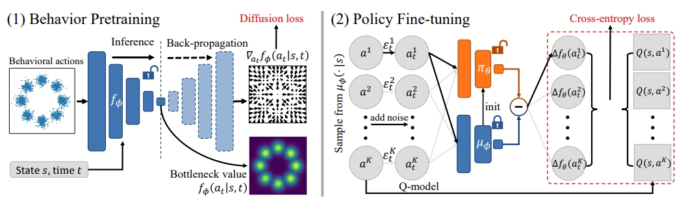

train_critic.py provides training script of IQL.

train_behavior.py provides training script of the bottleneck diffusion model.

finetune_policy.py provides training script of the alignment stage.

Our codebase is based on the implementation of https://github.com/thu-ml/SRPO (MIT License).


# Efficient Diffusion Policy Alignment

This repo contains implementation of the EDA algorithm used in

> [**Aligning Diffusion Behaviors with Q-functions for Efficient Continuous Control**](https://arxiv.org/pdf/2407.09024)<br>
> Huayu Chen, Kaiwen Zheng, Hang Su, Jun Zhu
> <br>Tsinghua<br>

EDA allows you to directly finetunes a diffusion behavior policy learned through imitation learning into an RL optimized policy (just like LLM alignment): 

<p align="center">

<p>

EDA leverages a specially-designed diffsuion model architecture so that it can calculate likelihood in one forward step:

<p align="center">

<p>


# D4RL experiments

## Requirements
Installations of [PyTorch](https://pytorch.org/), [MuJoCo](https://github.com/deepmind/mujoco), and [D4RL](https://github.com/Farama-Foundation/D4RL) are needed.

## Running
Before performing alignment, we need to first pretrain the critic Q model and the bottleneck behavior model. 

Respectively run

```.bash
TASK="halfcheetah-medium-v2"; seed=0; python3 -u train_behavior.py --expid ${TASK}-baseline-seed${seed} --env $TASK --seed ${seed}
```

```.bash
TASK="halfcheetah-medium-v2"; seed=0; python3 -u train_critic.py --expid ${TASK}-baseline-seed${seed} --env $TASK --seed ${seed}
```


Finally, run

```.bash
TASK="halfcheetah-medium-v2"; seed=0; python3 -u finetune_policy.py --expid ${TASK}-baseline-seed${seed} --env $TASK --seed ${seed} --actor_load_path ./EDA_model_factory/${TASK}-baseline-seed${seed}/behavior_ckpt200.pth --critic_load_path ./EDA_model_factory/${TASK}-baseline-seed${seed}/critic_ckpt150.pth --beta=0.1
```

# Citation
If you find our project helpful, please consider citing

@article{chen2024aligning,
  title={Aligning Diffusion Behaviors with Q-functions for Efficient Continuous Control},
  author={Chen, Huayu and Zheng, Kaiwen and Su, Hang and Zhu, Jun},
  journal={arXiv preprint arXiv:2407.09024},
  year={2024}
}

# License and Citation

MIT